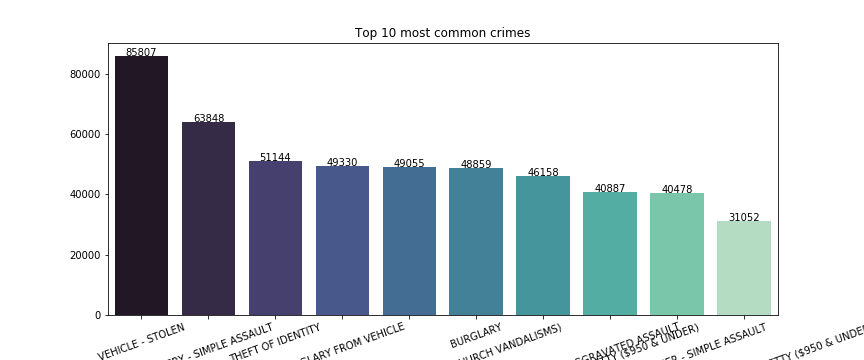
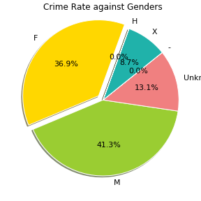
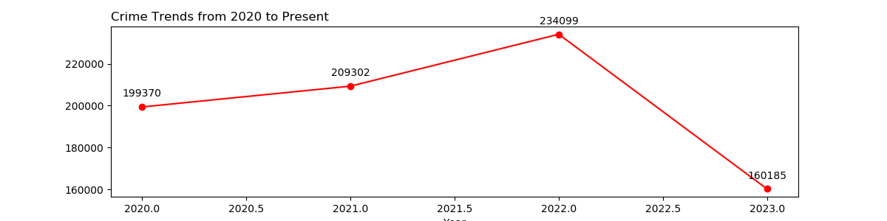
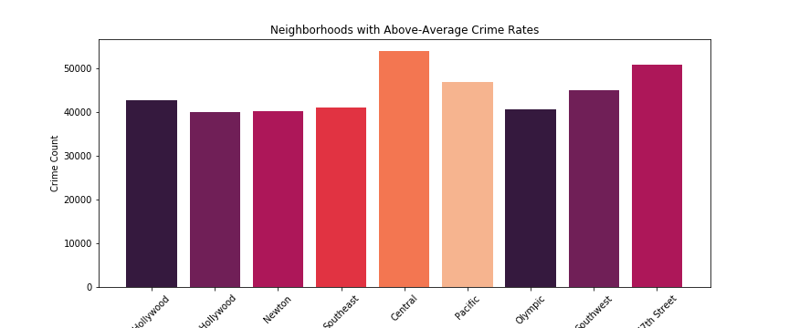
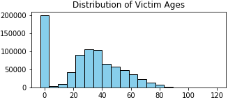
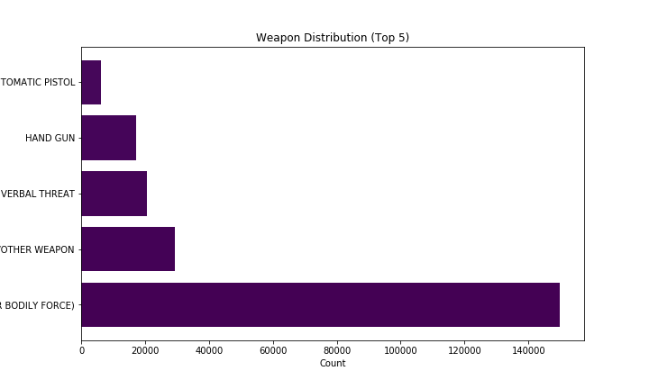

Los Angeles Crime Data Analysis
-
Steps to run
-
1. Setup GCP with 1 Master node and 2 Worker nodes
2. Open Jupyter notebook in the GCP Cluster
3. Upload the dataset from <a href="https://www.kaggle.com/datasets/nathaniellybrand/los-angeles-crime-dataset-2020-present" target="_blank">Kaggle</a> to GCS Bucket
4. Create a PySpark Session
5. Read the dataset from jupyter by executing the following command 
```
gcs_file_path = "gs://<Bucket_Name>/<Dataset>.csv"
df = spark.read.csv(gcs_file_path, header=True, inferSchema=True)
```
6. Run the "Analysis.py" in file to view the analysis and graphs. The photos will be stored in the GCS Bucket.
7. Run the "Model.py" file to view the prediction model. The prediction model will be stored in the GCS Bucket.


Top 10 most common crimes
-


Crime Rate Against Genders
-



Crimes Trends from 2020 to 2023
-


Neighbourhoods with above average Crime Rates
-



Victime Ages
-


Weapon Distribution
-
